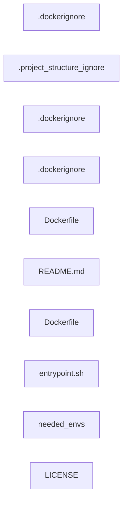
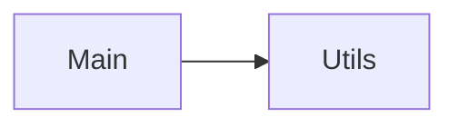

Repository Summary:
Files analyzed: 10
Directories scanned: 95
Total size: 21.50 KB (22020 bytes)
Estimated tokens: 5505
Processing time: 0.06 seconds


## Table of Contents

- [Project Summary](#project-summary)
- [Directory Structure](#directory-structure)
- [Files Content](#files-content)
  - Files By Category:
    - Documentation (1 files):
      - [README.md](#README_md) - 8.1 KB
    - Other (8 files):
      - [.dockerignore](#_dockerignore) - 0 bytes
      - [.dockerignore](#_dockerignore) - 0 bytes
      - [.dockerignore](#_dockerignore) - 0 bytes
      - [.project_structure_ignore](#_project_structure_ignore) - 0 bytes
      - [Dockerfile](#Dockerfile) - 706 bytes
      - [Dockerfile](#Dockerfile) - 748 bytes
      - [LICENSE](#LICENSE) - 11.3 KB
      - [needed_envs](#needed_envs) - 268 bytes
    - Other (sh) (1 files):
      - [entrypoint.sh](#entrypoint_sh) - 310 bytes
- [Architecture and Relationships](#architecture-and-relationships)
  - [File Dependencies](#file-dependencies)
  - [Class Relationships](#class-relationships)
  - [Component Interactions](#component-interactions)

## Project Summary <a id="project-summary"></a>

# Project Digest: cicd-newsapp
Generated on: Thu Aug 14 2025 22:56:44 GMT+0300 (Israel Daylight Time)
Source: c:\Users\Lenovo\cicd-newsapp
Project Directory: c:\Users\Lenovo\cicd-newsapp

# Directory Structure
[DIR] .
  [FILE] .dockerignore
  [DIR] .git
  [DIR] .github
    [DIR] workflows
  [DIR] .vscode
  [DIR] backend
    [FILE] .dockerignore
    [FILE] Dockerfile
  [DIR] CodeFlattened_Output
  [DIR] docs
  [DIR] frontend
    [FILE] .dockerignore
    [FILE] Dockerfile
    [DIR] nginx
      [FILE] entrypoint.sh
  [FILE] LICENSE
  [FILE] needed_envs
  [FILE] README.md
  [DIR] _docs
    [FILE] .project_structure_ignore

# Files Content

## .dockerignore <a id="dockerignore"></a>


## _docs\.project_structure_ignore <a id="project_structure_ignore"></a>


## backend\.dockerignore <a id="dockerignore"></a>


## frontend\.dockerignore <a id="dockerignore"></a>


## README.md <a id="README_md"></a>

<div align='center'>

<h1> GitHub Actions CI/CD Project</h1>

<p> A complete GitOps-based Kubernetes CI/CD pipeline using GitHub Actions, Argo CD, Docker, SonarCloud, and Snyk. </p>

<h4>
  <span> · </span>
  <a href="https://github.com/eli-pavlov/github-actions-cicd-project/blob/master/README.md"> Documentation </a>
  <span> · </span>
  <a href="https://github.com/eli-pavlov/github-actions-cicd-project/issues"> Report Bug </a>
  <span> · </span>
  <a href="https://github.com/eli-pavlov/github-actions-cicd-project/issues"> Request Feature </a>
</h4>

$\~\~\$

</div>

## \:world\_map: Project Diagram


$\~\~\$

\:notebook\_with\_decorative\_cover: Table of Contents

* [Project Diagram](#world_map-project-diagram)
* [About the Project](#star2-about-the-project)
* [CI/CD Workflow Overview](#gear-cicd-workflow-overview)
* [How to Set It Up](#wrench-how-to-set-it-up)
* [Project Structure](#open_file_folder-project-structure)
* [Secrets and Environments](#lock-secrets-and-environments)
* [License](#warning-license)
* [Contact](#handshake-contact)
* [Acknowledgements](#gem-acknowledgements)

$\~\~\$

## \:star2: About the Project

This project delivers an **end-to-end CI/CD pipeline** for a Python Flask web app.

**Key Features & Goals:**

* GitOps-driven continuous deployment using Argo CD and Kustomize overlays.
* **Semantic, unique Docker image tags** per deployment (e.g., `dev-abc1234`, `latest-abc1234`).
* Multi-stage CI/CD with linting, unit tests, code quality (SonarCloud), and security (Snyk).
* **Automatic updates to [manifests repo](https://github.com/eli-pavlov/github-actions-cicd-manifests)** to trigger deployments via Argo CD.
* Supports both automated dev deployments and manual-approval prod deployments.

**Why GitHub Actions?**

| Feature                      | Justification                                                                       |
| ---------------------------- | ----------------------------------------------------------------------------------- |
| 💰 **Cost-effective**        | Free for public repos, generous for private projects                                |
| 🔗 **Native Integration**    | Tight GitHub ecosystem fit: PRs, branches, commits, secrets                         |
| 🧰 **Rich Ecosystem**        | Thousands of actions for Docker, Argo CD, SonarCloud, Snyk, Slack, and more         |
| 👨‍💻 **Developer-Friendly** | Clean YAML, full commit history, branch-aware logic, easy rollbacks                 |
| 🔒 **Security**              | Encrypted secrets, support for environment approvals                                |
| ⚙️ **Scalable & Extensible** | Matrix jobs, reusable workflows, custom triggers, and environment-based deployments |

$\~\~\$

**Other tools used:**

* **GitOps:** [Argo CD](https://argo-cd.readthedocs.io/) for declarative Kubernetes deployment/version control.
* **Code Quality:** [SonarCloud](https://www.sonarcloud.io) for static analysis.
* **Security:** [Snyk](https://www.snyk.io) for IaC and dependency scanning.
* **Docker Hub** for image registry.

$\~\~\$

**Branching & Deployment Strategy:**

* `development`: Triggers full CI/CD pipeline, auto-deploys to development (K8s `development` namespace).
* `main`: Requires manual approval, deploys to production (`default` namespace).

$\~\~\$

## \:gear: CI/CD Workflow Overview

1. **Lint-and-Test**

   * Install dependencies, run `flake8`, execute unit tests with `pytest` + coverage.

2. **SonarCloud Analysis**

   * Perform static code analysis (using full git history).

3. **Snyk IaC Scan**

   * Scan Kubernetes manifests and Dockerfile for vulnerabilities.

4. **Build and Push Docker Image**

   * Build multi-arch Docker images (`dev-<sha>` or `latest-<sha>`).
   * Push image to Docker Hub.

5. **Update Manifests Repo (GitOps)**

   * Automatically update the correct overlay's `kustomization.yaml` in [github-actions-cicd-manifests](https://github.com/eli-pavlov/github-actions-cicd-manifests) with the new image tag.
   * Commit and push change.

6. **Argo CD Deployment**

   * Argo CD watches the manifests repo:

     * `/manifests/overlays/development` for dev
     * `/manifests/overlays/production` for prod
   * Syncs Kubernetes cluster with new image on change.

7. **Slack Notification (Optional)**

   * Post build/deploy status to Slack channel.

$\~\~\$

## \:wrench: How to Set It Up

### Prerequisites

* Fork or clone this repository.
* DockerHub account
* SonarCloud and Snyk accounts (optional, for quality/security)
* Kubernetes cluster with Argo CD installed and configured

### Steps

1. **Add required GitHub Secrets** (see [Secrets and Environments](#lock-secrets-and-environments)).
2. **Install Argo CD** on your cluster, if not already present.
3. **Apply Argo CD Applications** (see [manifests repo](https://github.com/eli-pavlov/github-actions-cicd-manifests)):

   ```bash
   kubectl apply -f manifests/argocd/application-dev.yaml
   kubectl apply -f manifests/argocd/application-prod.yaml
   ```
4. **Push to `development`**: triggers auto-deploy to dev environment.
5. **Merge to `main`**: requires approval and deploys to production.

$\~\~\$

## \:open\_file\_folder: Project Structure

```
github-actions-cicd-project/
├── Dockerfile
├── README.md
├── requirements.txt
├── src/
│   ├── app.py
│   ├── __init__.py
│   └── templates/index.html
├── tests/test_app.py
├── docs/
│   ├── ci-cd-diagram-rtproject.pdf
│   ├── devops_cycle.jpg
│   ├── githubactions.png
│   ├── githubactions2.png
│   └── rtproject-diagram.png
├── manifests/
│   ├── base/             # Base K8s Deployment/Service (reference only)
│   ├── overlays/         # Overlays for dev and prod (reference only)
│   └── argocd/           # Argo CD App manifests (reference only)
└── .github/workflows/
    └── main.yml
```

> **Note:** Actual manifests for deployment are maintained in
> [github-actions-cicd-manifests](https://github.com/eli-pavlov/github-actions-cicd-manifests).

$\~\~\$

## \:lock: Secrets and Environments

> Add these secrets under **GitHub repo settings** → **Secrets and variables** → **Actions**

| Secret Key           | Description                           |
| -------------------- | ------------------------------------- |
| `APP_NAME`           | Docker image/app name                 |
| `DOCKERHUB_USERNAME` | Docker Hub username                   |
| `DOCKERHUB_TOKEN`    | Docker Hub token                      |
| `SONAR_TOKEN`        | SonarCloud token                      |
| `SONAR_ORGANIZATION` | SonarCloud organization               |
| `SONAR_PROJECT_KEY`  | SonarCloud project key                |
| `SNYK_TOKEN`         | Snyk token                            |
| `SLACK_WEBHOOK_URL`  | (Optional) Slack Incoming Webhook URL |
| `GH_TOKEN`           | Token for pushing to manifests repo   |

**GitHub Environments**:

* **development**: Auto-deploys on push to `development`.
* **production**: Requires manual approval before workflow runs for `main`.

$\~\~\$

## \:warning: License

Distributed under the Apache 2.0 License.

Please note: SonarCloud, Snyk, DockerHub, and Argo CD each have their own licensing terms.

$\~\~\$

## \:handshake: Contact

**Eli Pavlov**
[www.weblightenment.com](https://www.weblightenment.com)
[admin@weblightenment.com](mailto:admin@weblightenment.com)

Project Repo: [github-actions-cicd-project](https://github.com/eli-pavlov/github-actions-cicd-project)

$\~\~\$

## \:gem: Acknowledgements

* [Kubernetes.io](https://kubernetes.io/docs)
* [SonarCloud](https://www.sonarcloud.io)
* [Snyk](https://www.snyk.io)
* [DockerHub](https://hub.docker.com)
* [Argo CD](https://argo-cd.readthedocs.io/en/stable/)
* [GitHub Actions](https://docs.github.com/en/actions)
* [Awesome GitHub README Generator](https://www.genreadme.cloud/)

## frontend\Dockerfile <a id="Dockerfile"></a>

### Dependencies

- `node:22-alpine`
- `nginx:1.27-alpine`
- `build`

# ---- build stage ----
FROM node:22-alpine AS build
WORKDIR /app

# Install deps
COPY package*.json ./
RUN npm ci

# Copy source and build
COPY . .
RUN npm run build

# ---- serve stage ----
FROM nginx:1.27-alpine
WORKDIR /app

# Clean default nginx html
RUN rm -rf /usr/share/nginx/html/*

# Copy built frontend from build stage
COPY --from=build /app/backend/public/app /usr/share/nginx/html

# Copy Nginx template & entrypoint for reverse proxy config
COPY nginx/default.conf.template /etc/nginx/templates/default.conf.template
COPY nginx/entrypoint.sh /entrypoint.sh
RUN chmod +x /entrypoint.sh

EXPOSE 80
ENTRYPOINT ["/entrypoint.sh"]
CMD ["nginx", "-g", "daemon off;"]

## backend\Dockerfile <a id="Dockerfile"></a>

### Dependencies

- `node:22-alpine`

# ---- build stage ----
FROM node:22-alpine AS build
WORKDIR /app

# Install deps first for better caching
COPY package*.json ./
RUN npm ci --omit=dev

# Copy the rest and (optionally) build if you transpile; if not, skip
COPY . .
# If you use TypeScript or a build step, uncomment:
# RUN npm run build

# ---- runtime stage ----
FROM node:22-alpine AS runtime
ENV NODE_ENV=production \
    PORT=3000
WORKDIR /app

# Copy only the production deps and app source
COPY --from=build /app/node_modules ./node_modules
COPY --from=build /app ./

# Create non-root user for safety
RUN addgroup -S app && adduser -S app -G app
USER app

EXPOSE 3000
# Adjust if your main file differs (app.js/server.js)
CMD ["node", "app.js"]

## frontend\nginx\entrypoint.sh <a id="entrypoint_sh"></a>

#!/bin/sh
set -eu

NS="${POD_NAMESPACE:-default}"
: "${BACKEND_SERVICE_HOST:=backend.${NS}.svc.cluster.local}"
: "${BACKEND_SERVICE_PORT:=8080}"

envsubst '$BACKEND_SERVICE_HOST $BACKEND_SERVICE_PORT' \
  < /etc/nginx/templates/default.conf.template \
  > /etc/nginx/conf.d/default.conf

exec "$@"

## needed_envs <a id="needed_envs"></a>

VITE_SERVER_URL= {{VITE_SERVER_URL}}
VITE_NEWS_INTERVAL_IN_MIN= {{VITE_NEWS_INTERVAL_IN_MIN}}
# MONGO | MONGOOSE | POSTGRES | MYSQL
DB_ENGINE_TYPE={{DB_ENGINE_TYPE}}
# connection string : [protocol]://[username]:[password]@[host]/[database name]
DB_URI={{DB_URI}}
## LICENSE <a id="LICENSE"></a>

                                 Apache License
                           Version 2.0, January 2004
                        http://www.apache.org/licenses/

   TERMS AND CONDITIONS FOR USE, REPRODUCTION, AND DISTRIBUTION

   1. Definitions.

      "License" shall mean the terms and conditions for use, reproduction,
      and distribution as defined by Sections 1 through 9 of this document.

      "Licensor" shall mean the copyright owner or entity authorized by
      the copyright owner that is granting the License.

      "Legal Entity" shall mean the union of the acting entity and all
      other entities that control, are controlled by, or are under common
      control with that entity. For the purposes of this definition,
      "control" means (i) the power, direct or indirect, to cause the
      direction or management of such entity, whether by contract or
      otherwise, or (ii) ownership of fifty percent (50%) or more of the
      outstanding shares, or (iii) beneficial ownership of such entity.

      "You" (or "Your") shall mean an individual or Legal Entity
      exercising permissions granted by this License.

      "Source" form shall mean the preferred form for making modifications,
      including but not limited to software source code, documentation
      source, and configuration files.

      "Object" form shall mean any form resulting from mechanical
      transformation or translation of a Source form, including but
      not limited to compiled object code, generated documentation,
      and conversions to other media types.

      "Work" shall mean the work of authorship, whether in Source or
      Object form, made available under the License, as indicated by a
      copyright notice that is included in or attached to the work
      (an example is provided in the Appendix below).

      "Derivative Works" shall mean any work, whether in Source or Object
      form, that is based on (or derived from) the Work and for which the
      editorial revisions, annotations, elaborations, or other modifications
      represent, as a whole, an original work of authorship. For the purposes
      of this License, Derivative Works shall not include works that remain
      separable from, or merely link (or bind by name) to the interfaces of,
      the Work and Derivative Works thereof.

      "Contribution" shall mean any work of authorship, including
      the original version of the Work and any modifications or additions
      to that Work or Derivative Works thereof, that is intentionally
      submitted to Licensor for inclusion in the Work by the copyright owner
      or by an individual or Legal Entity authorized to submit on behalf of
      the copyright owner. For the purposes of this definition, "submitted"
      means any form of electronic, verbal, or written communication sent
      to the Licensor or its representatives, including but not limited to
      communication on electronic mailing lists, source code control systems,
      and issue tracking systems that are managed by, or on behalf of, the
      Licensor for the purpose of discussing and improving the Work, but
      excluding communication that is conspicuously marked or otherwise
      designated in writing by the copyright owner as "Not a Contribution."

      "Contributor" shall mean Licensor and any individual or Legal Entity
      on behalf of whom a Contribution has been received by Licensor and
      subsequently incorporated within the Work.

   2. Grant of Copyright License. Subject to the terms and conditions of
      this License, each Contributor hereby grants to You a perpetual,
      worldwide, non-exclusive, no-charge, royalty-free, irrevocable
      copyright license to reproduce, prepare Derivative Works of,
      publicly display, publicly perform, sublicense, and distribute the
      Work and such Derivative Works in Source or Object form.

   3. Grant of Patent License. Subject to the terms and conditions of
      this License, each Contributor hereby grants to You a perpetual,
      worldwide, non-exclusive, no-charge, royalty-free, irrevocable
      (except as stated in this section) patent license to make, have made,
      use, offer to sell, sell, import, and otherwise transfer the Work,
      where such license applies only to those patent claims licensable
      by such Contributor that are necessarily infringed by their
      Contribution(s) alone or by combination of their Contribution(s)
      with the Work to which such Contribution(s) was submitted. If You
      institute patent litigation against any entity (including a
      cross-claim or counterclaim in a lawsuit) alleging that the Work
      or a Contribution incorporated within the Work constitutes direct
      or contributory patent infringement, then any patent licenses
      granted to You under this License for that Work shall terminate
      as of the date such litigation is filed.

   4. Redistribution. You may reproduce and distribute copies of the
      Work or Derivative Works thereof in any medium, with or without
      modifications, and in Source or Object form, provided that You
      meet the following conditions:

      (a) You must give any other recipients of the Work or
          Derivative Works a copy of this License; and

      (b) You must cause any modified files to carry prominent notices
          stating that You changed the files; and

      (c) You must retain, in the Source form of any Derivative Works
          that You distribute, all copyright, patent, trademark, and
          attribution notices from the Source form of the Work,
          excluding those notices that do not pertain to any part of
          the Derivative Works; and

      (d) If the Work includes a "NOTICE" text file as part of its
          distribution, then any Derivative Works that You distribute must
          include a readable copy of the attribution notices contained
          within such NOTICE file, excluding those notices that do not
          pertain to any part of the Derivative Works, in at least one
          of the following places: within a NOTICE text file distributed
          as part of the Derivative Works; within the Source form or
          documentation, if provided along with the Derivative Works; or,
          within a display generated by the Derivative Works, if and
          wherever such third-party notices normally appear. The contents
          of the NOTICE file are for informational purposes only and
          do not modify the License. You may add Your own attribution
          notices within Derivative Works that You distribute, alongside
          or as an addendum to the NOTICE text from the Work, provided
          that such additional attribution notices cannot be construed
          as modifying the License.

      You may add Your own copyright statement to Your modifications and
      may provide additional or different license terms and conditions
      for use, reproduction, or distribution of Your modifications, or
      for any such Derivative Works as a whole, provided Your use,
      reproduction, and distribution of the Work otherwise complies with
      the conditions stated in this License.

   5. Submission of Contributions. Unless You explicitly state otherwise,
      any Contribution intentionally submitted for inclusion in the Work
      by You to the Licensor shall be under the terms and conditions of
      this License, without any additional terms or conditions.
      Notwithstanding the above, nothing herein shall supersede or modify
      the terms of any separate license agreement you may have executed
      with Licensor regarding such Contributions.

   6. Trademarks. This License does not grant permission to use the trade
      names, trademarks, service marks, or product names of the Licensor,
      except as required for reasonable and customary use in describing the
      origin of the Work and reproducing the content of the NOTICE file.

   7. Disclaimer of Warranty. Unless required by applicable law or
      agreed to in writing, Licensor provides the Work (and each
      Contributor provides its Contributions) on an "AS IS" BASIS,
      WITHOUT WARRANTIES OR CONDITIONS OF ANY KIND, either express or
      implied, including, without limitation, any warranties or conditions
      of TITLE, NON-INFRINGEMENT, MERCHANTABILITY, or FITNESS FOR A
      PARTICULAR PURPOSE. You are solely responsible for determining the
      appropriateness of using or redistributing the Work and assume any
      risks associated with Your exercise of permissions under this License.

   8. Limitation of Liability. In no event and under no legal theory,
      whether in tort (including negligence), contract, or otherwise,
      unless required by applicable law (such as deliberate and grossly
      negligent acts) or agreed to in writing, shall any Contributor be
      liable to You for damages, including any direct, indirect, special,
      incidental, or consequential damages of any character arising as a
      result of this License or out of the use or inability to use the
      Work (including but not limited to damages for loss of goodwill,
      work stoppage, computer failure or malfunction, or any and all
      other commercial damages or losses), even if such Contributor
      has been advised of the possibility of such damages.

   9. Accepting Warranty or Additional Liability. While redistributing
      the Work or Derivative Works thereof, You may choose to offer,
      and charge a fee for, acceptance of support, warranty, indemnity,
      or other liability obligations and/or rights consistent with this
      License. However, in accepting such obligations, You may act only
      on Your own behalf and on Your sole responsibility, not on behalf
      of any other Contributor, and only if You agree to indemnify,
      defend, and hold each Contributor harmless for any liability
      incurred by, or claims asserted against, such Contributor by reason
      of your accepting any such warranty or additional liability.

   END OF TERMS AND CONDITIONS

   APPENDIX: How to apply the Apache License to your work.

      To apply the Apache License to your work, attach the following
      boilerplate notice, with the fields enclosed by brackets "[]"
      replaced with your own identifying information. (Don't include
      the brackets!)  The text should be enclosed in the appropriate
      comment syntax for the file format. We also recommend that a
      file or class name and description of purpose be included on the
      same "printed page" as the copyright notice for easier
      identification within third-party archives.

   Copyright [yyyy] [name of copyright owner]

   Licensed under the Apache License, Version 2.0 (the "License");
   you may not use this file except in compliance with the License.
   You may obtain a copy of the License at

       http://www.apache.org/licenses/LICENSE-2.0

   Unless required by applicable law or agreed to in writing, software
   distributed under the License is distributed on an "AS IS" BASIS,
   WITHOUT WARRANTIES OR CONDITIONS OF ANY KIND, either express or implied.
   See the License for the specific language governing permissions and
   limitations under the License.
## Code Visualization


### Architecture and Relationships

These diagrams visualize code relationships at different levels of abstraction.

### File Dependencies

This diagram shows dependencies between individual source files.

#

Below is a visualization of file dependencies in the codebase:



### Class Relationships

This diagram shows inheritance and associations between classes.

```mermaid
classDiagram
```




<!-- TEST VISUALIZATION MARKER -->


