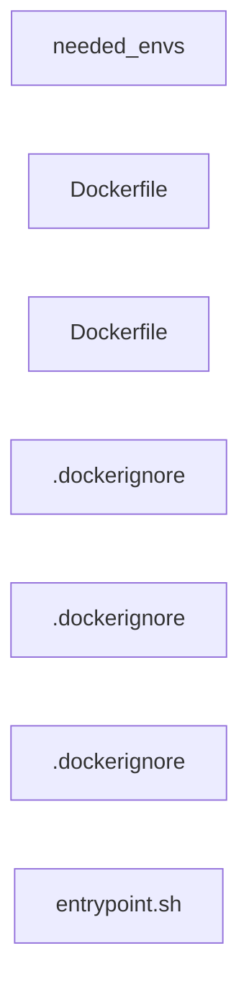
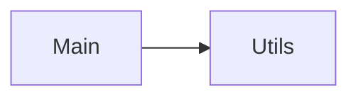

Repository Summary:
Files analyzed: 7
Directories scanned: 23
Total size: 2.09 KB (2137 bytes)
Estimated tokens: 534
Processing time: 0.03 seconds


## Table of Contents

- [Project Summary](#project-summary)
- [Directory Structure](#directory-structure)
- [Files Content](#files-content)
  - Files By Category:
    - Other (6 files):
      - [.dockerignore](#_dockerignore) - 0 bytes
      - [.dockerignore](#_dockerignore) - 0 bytes
      - [.dockerignore](#_dockerignore) - 0 bytes
      - [Dockerfile](#Dockerfile) - 807 bytes
      - [Dockerfile](#Dockerfile) - 748 bytes
      - [needed_envs](#needed_envs) - 270 bytes
    - Other (sh) (1 files):
      - [entrypoint.sh](#entrypoint_sh) - 310 bytes
- [Architecture and Relationships](#architecture-and-relationships)
  - [File Dependencies](#file-dependencies)
  - [Class Relationships](#class-relationships)
  - [Component Interactions](#component-interactions)

## Project Summary <a id="project-summary"></a>

# Project Digest: cicd-newsapp
Generated on: Fri Aug 15 2025 00:35:06 GMT+0300 (Israel Daylight Time)
Source: c:\Users\Eli\newsapp\cicd-newsapp
Project Directory: c:\Users\Eli\newsapp\cicd-newsapp

# Directory Structure
[DIR] .
  [FILE] .dockerignore
  [DIR] .git
  [DIR] .github
    [DIR] workflows
  [DIR] .vscode
  [DIR] backend
    [FILE] .dockerignore
    [FILE] Dockerfile
  [DIR] CodeFlattened_Output
  [DIR] frontend
    [FILE] .dockerignore
    [FILE] Dockerfile
    [DIR] nginx
      [FILE] entrypoint.sh
  [FILE] needed_envs

# Files Content

## needed_envs <a id="needed_envs"></a> 🔄 **[RECENTLY MODIFIED]**

VITE_SERVER_URL= {{VITE_SERVER_URL}}
VITE_NEWS_INTERVAL_IN_MIN= {{VITE_NEWS_INTERVAL_IN_MIN}}
# MONGO | MONGOOSE | POSTGRES | MYSQL
DB_ENGINE_TYPE= {{DB_ENGINE_TYPE}}
# connection string : [protocol]://[username]:[password]@[host]/[database name]
DB_URI= {{DB_URI}}
## frontend\Dockerfile <a id="Dockerfile"></a>

### Dependencies

- `node:22-alpine`
- `build`
- `nginx:1.27-alpine`

# ---- build stage ----
FROM node:22-alpine AS build
WORKDIR /app

COPY package*.json ./
RUN npm ci

# Pass Vite args from build args
ARG VITE_SERVER_URL
ARG VITE_NEWS_INTERVAL_IN_MIN
ENV VITE_SERVER_URL=$VITE_SERVER_URL
ENV VITE_NEWS_INTERVAL_IN_MIN=$VITE_NEWS_INTERVAL_IN_MIN

COPY . .
RUN npm run build

# ---- serve stage ----
FROM nginx:1.27-alpine
WORKDIR /app

# Remove default html
RUN rm -rf /usr/share/nginx/html/*

# ✅ Copy the actual build output
COPY --from=build /app/backend/public/app /usr/share/nginx/html

# Nginx reverse proxy config
COPY nginx/default.conf.template /etc/nginx/templates/default.conf.template
COPY nginx/entrypoint.sh /entrypoint.sh
RUN chmod +x /entrypoint.sh

EXPOSE 80
ENTRYPOINT ["/entrypoint.sh"]
CMD ["nginx", "-g", "daemon off;"]

## backend\Dockerfile <a id="Dockerfile"></a>

### Dependencies

- `node:22-alpine`

# ---- build stage ----
FROM node:22-alpine AS build
WORKDIR /app

# Install deps first for better caching
COPY package*.json ./
RUN npm ci --omit=dev

# Copy the rest and (optionally) build if you transpile; if not, skip
COPY . .
# If you use TypeScript or a build step, uncomment:
# RUN npm run build

# ---- runtime stage ----
FROM node:22-alpine AS runtime
ENV NODE_ENV=production \
    PORT=8080
WORKDIR /app

# Copy only the production deps and app source
COPY --from=build /app/node_modules ./node_modules
COPY --from=build /app ./

# Create non-root user for safety
RUN addgroup -S app && adduser -S app -G app
USER app

EXPOSE 8080
# Adjust if your main file differs (app.js/server.js)
CMD ["node", "app.js"]

## backend\.dockerignore <a id="dockerignore"></a>


## .dockerignore <a id="dockerignore"></a>


## frontend\.dockerignore <a id="dockerignore"></a>


## frontend\nginx\entrypoint.sh <a id="entrypoint_sh"></a>

#!/bin/sh
set -eu

NS="${POD_NAMESPACE:-default}"
: "${BACKEND_SERVICE_HOST:=backend.${NS}.svc.cluster.local}"
: "${BACKEND_SERVICE_PORT:=8080}"

envsubst '$BACKEND_SERVICE_HOST $BACKEND_SERVICE_PORT' \
  < /etc/nginx/templates/default.conf.template \
  > /etc/nginx/conf.d/default.conf

exec "$@"
## Code Visualization


### Architecture and Relationships

These diagrams visualize code relationships at different levels of abstraction.

### File Dependencies

This diagram shows dependencies between individual source files.

#

Below is a visualization of file dependencies in the codebase:



### Class Relationships

This diagram shows inheritance and associations between classes.

```mermaid
classDiagram
```




<!-- TEST VISUALIZATION MARKER -->


